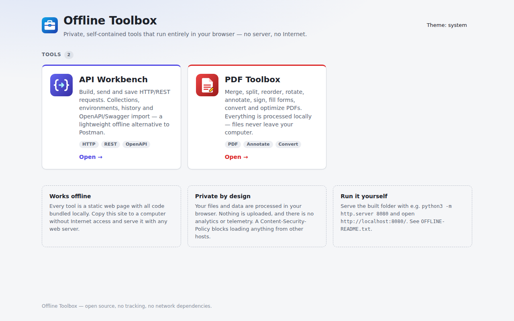
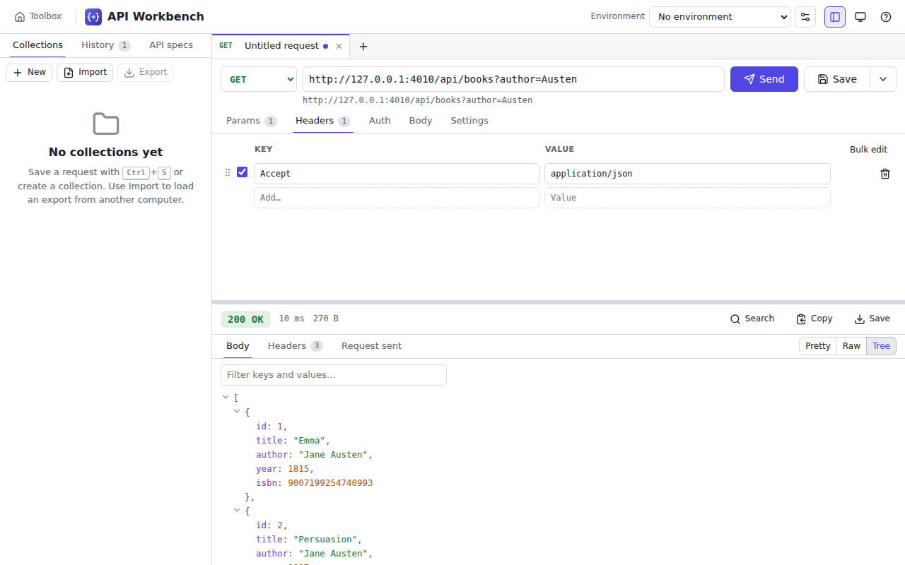
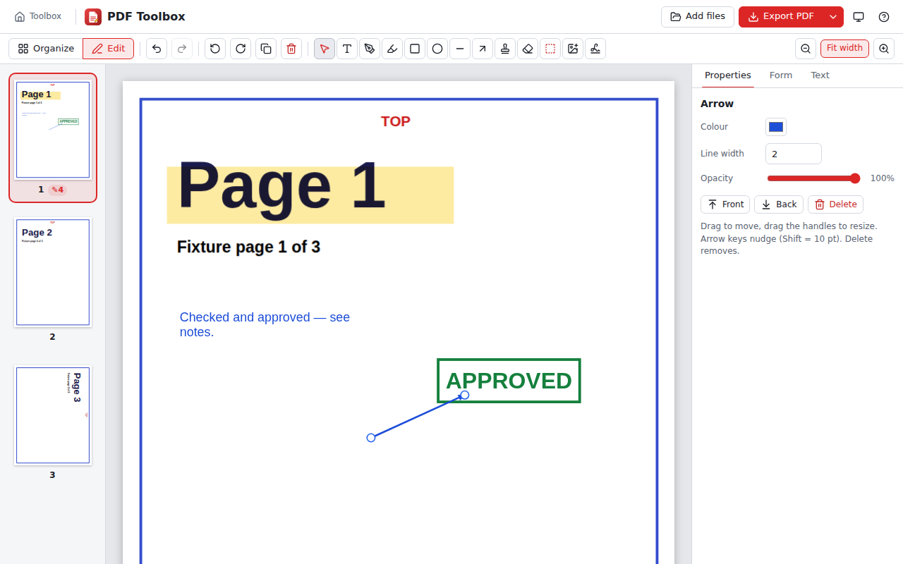
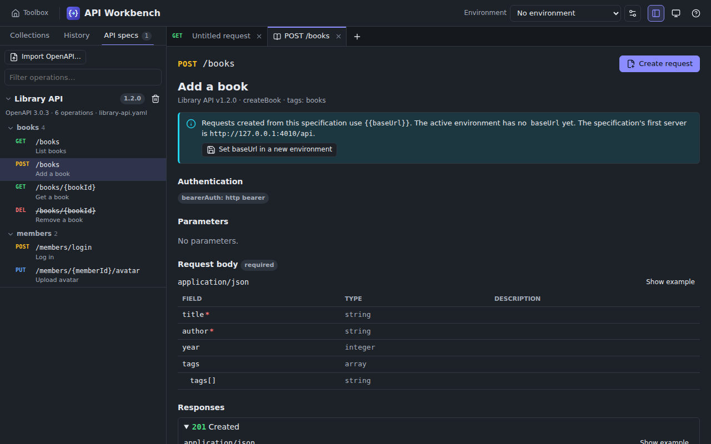
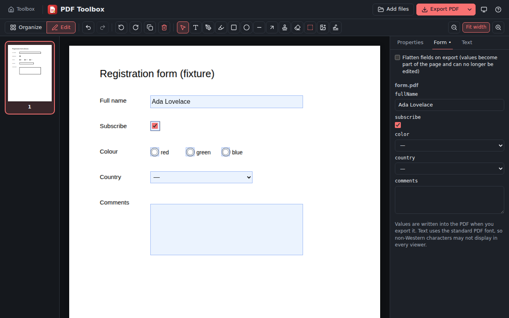

# Offline Toolbox

A growing collection of **private, self-contained browser tools** that run entirely as static
files — no backend, no Internet connection, no installation.

The whole collection is built into one folder, [`dist/`](dist/), which is committed to this
repository. You can

1. use it on **GitHub Pages** for convenient testing,
2. download the repository as a ZIP,
3. copy it to an **isolated (air-gapped) Linux network**, and
4. serve `dist/` with any simple static web server — every tool works exactly the same.

**GitHub Pages:** <https://pcowhill.github.io/offline-toolbox/> (after the one-time setup in
[Deployment](#deployment-github-pages)).



## Included tools

| Tool                                                         | What it does                                                                                                                                                                                                                                                                                                                                                                                                       |
| ------------------------------------------------------------ | ------------------------------------------------------------------------------------------------------------------------------------------------------------------------------------------------------------------------------------------------------------------------------------------------------------------------------------------------------------------------------------------------------------------ |
| **[API Workbench](apps/api-workbench/)** (`/api-workbench/`) | Postman/Swagger-style HTTP client: build and send REST requests (GET, POST, PUT, PATCH, DELETE, HEAD, OPTIONS), query/header editors, Basic/Bearer auth, JSON/raw/form/multipart bodies, pretty/raw/tree response views with search, collections & folders, environments and `{{variables}}`, history, OpenAPI 3.x / Swagger 2.0 import, curl import/export, JSON export/import for moving work between computers. |
| **[PDF Toolbox](apps/pdf-toolbox/)** (`/pdf-toolbox/`)       | PDFgear/Acrobat-style PDF utility: merge, split, extract, reorder (drag & drop), rotate, duplicate and delete pages; text, freehand drawing, highlight, shapes, lines, arrows, stamps, images and signatures; fill AcroForm fields (optionally flatten); images → PDF; pages → PNG/JPEG; text and image extraction; whiteout and **secure redaction**; file-size optimisation.                                     |

| API Workbench                                                                    | PDF Toolbox                                                      |
| -------------------------------------------------------------------------------- | ---------------------------------------------------------------- |
|                              |      |
|  |  |

## Privacy and offline philosophy

- **Everything runs locally in the browser.** Files and data are processed in the browser tab and
  are never uploaded. There is no server component.
- **No external resources at runtime.** No CDNs, web fonts, analytics, telemetry or cloud APIs.
  All JavaScript, CSS, fonts (system fonts only), icons, the pdf.js worker, character maps,
  standard fonts and WebAssembly decoders are bundled into `dist/`.
- **Enforced, not just promised.** Every page ships a strict `Content-Security-Policy`
  (`default-src 'self'`), so the browser itself refuses to load code, styles, fonts or images from
  other hosts. API Workbench additionally allows `connect-src http: https:` — needed to send the
  requests _you_ explicitly make — and nothing else.
- **Tested as if the Internet did not exist.** The end-to-end tests abort and fail on any request
  to a non-local host.
- **Local storage is explicit.** API Workbench stores collections, environments, history and
  imported specs in the browser's IndexedDB (never synced anywhere); sensitive variable values are
  kept in memory only unless you choose to save them, and credentials typed into the Auth tab or
  credential headers (`Authorization`, `Cookie`, API keys) are not saved unless you opt in. PDF Toolbox keeps documents in memory only.

## Repository architecture

```
offline-toolbox/
├── tools.config.json      ← the tool registry: the single place that lists every tool
├── apps/
│   ├── api-workbench/     ← one folder per tool (index.html, icon.svg, src/)
│   └── pdf-toolbox/       │  optional tool.vite.mjs for tool-specific build needs
├── portal/                ← launcher page; its tool cards are generated from tools.config.json
├── shared/                ← design tokens/styles, React components (header, dialogs, tabs, toasts …)
├── scripts/
│   ├── build.mjs          ← builds the portal + every registered tool into dist/
│   ├── dev.mjs            ← Vite dev server for one tool
│   ├── serve.mjs          ← zero-dependency static server (also copied into dist/)
│   ├── verify-dist.mjs    ← structural/offline checks + "committed dist/ is up to date"
│   ├── generate-fixtures.mjs / screenshots.mjs
│   └── lib/               ← shared Vite config (CSP, theme bootstrap), registry, licence notices
├── tests/
│   ├── e2e/               ← Playwright tests against the built dist/ (root + subpath)
│   └── fixtures/          ← small self-made PDFs, images and OpenAPI files
├── dist/                  ← COMMITTED built site (serve this folder)
└── .github/workflows/ci.yml
```

**How it fits together**

- Each tool is a **separate Vite build** with a _relative_ base (`./`). That is what makes the same
  output work at `https://<owner>.github.io/<repo>/pdf-toolbox/`, at `http://localhost:8080/pdf-toolbox/`
  and inside any intranet sub-directory. Tools link back to the launcher with `../`.
- The shared Vite configuration (`scripts/lib/vite-config.mjs`) injects the Content-Security-Policy,
  a no-flash theme bootstrap (light/dark/system, shared by all tools) and `no-referrer`.
- `shared/` is imported via the `@shared/*` alias; it is plain source (no separate package), which
  keeps the setup simple while avoiding duplication. Tools stay independent: one tool's code never
  imports another's.
- Builds are deterministic, so CI can rebuild from scratch and compare with the committed `dist/`.

**Key libraries**

| Library                                                                  | Used for                                                                           | Licence    | Why                                                                                                               |
| ------------------------------------------------------------------------ | ---------------------------------------------------------------------------------- | ---------- | ----------------------------------------------------------------------------------------------------------------- |
| React 19 + zustand                                                       | UI and state                                                                       | MIT        | Mature, small state library, no runtime network needs                                                             |
| Vite (Rolldown) + TypeScript                                             | Build                                                                              | MIT        | Fast static multi-app builds with relative paths                                                                  |
| [PDF.js](https://mozilla.github.io/pdf.js/) (`pdfjs-dist`, legacy build) | Rendering, thumbnails, text extraction, rasterising                                | Apache-2.0 | The reference open-source PDF renderer; the legacy build supports older browsers often found on isolated networks |
| [pdf-lib](https://pdf-lib.js.org/)                                       | Creating/modifying PDFs: merge, split, rotate, annotations, forms, image embedding | MIT        | Pure JavaScript, works in the browser, robust AcroForm support                                                    |
| CodeMirror 6                                                             | Body editors and response viewer (highlighting, folding, search, lint)             | MIT        | Handles large responses well, fully bundleable                                                                    |
| yaml                                                                     | OpenAPI YAML parsing                                                               | ISC        | Spec-compliant, with alias-bomb protection                                                                        |
| lucide-react                                                             | Icons (bundled SVG)                                                                | ISC        | Tree-shaken, no icon font download                                                                                |

The build writes `dist/THIRD-PARTY-NOTICES.txt` with the licence text of every bundled package;
pdf.js data files keep their licence files under `dist/pdf-toolbox/pdfjs/`.

## Local development

Requirements: **Node.js 22+** (only for development — not needed to _use_ the built site).

```bash
npm ci                          # install exact dependency versions
npm run dev -- api-workbench    # hot-reloading dev server for one tool (http://localhost:5173)
npm run dev -- pdf-toolbox
npm run check                   # lint + typecheck + format check + unit tests
npm run test:e2e                # browser tests against dist/ (run `npm run build` first)
```

First-time Playwright setup (outside this sandbox): `npx playwright install chromium`.

## Production build

```bash
npm run build                   # cleans and rebuilds dist/ (portal + all tools)
npm run verify:dist             # structural + offline checks of dist/
npm run verify:dist -- --git    # additionally fail if dist/ differs from what is committed
```

**`dist/` must be committed.** Whenever you change anything under `apps/`, `portal/`, `shared/`,
`scripts/lib/`, `tools.config.json` or dependencies, run `npm run build` and commit the resulting
`dist/` changes together with the source. CI rebuilds from scratch and fails if they differ.

## Serving `dist/` locally

Any static web server works; serve the `dist/` folder and open the printed address:

```bash
cd dist
python3 -m http.server 8080       # → http://localhost:8080/
# or, with Node.js:
node serve.mjs --port 8080        # bundled zero-dependency server
node serve.mjs --base /offline-toolbox/   # mimic the GitHub Pages sub-path
```

Use a web server rather than opening `index.html` from disk: browsers restrict module scripts, web
workers (used for PDF rendering) and IndexedDB on `file://` pages.

## Transferring to an isolated network

1. On a connected computer, download the repository (GitHub → _Code_ → _Download ZIP_) or a
   `git clone`. Only the `dist/` folder is needed — no Node.js or npm on the target.
2. Copy it to the isolated machine (USB drive, file transfer, …).
3. Serve it, e.g. `cd dist && python3 -m http.server 8080 --bind 0.0.0.0`, or place it in an
   existing nginx/Apache document root (any sub-directory is fine).
4. Open `http://<host>:8080/` in a browser.

Notes for the isolated network:

- **API Workbench and CORS.** The browser applies CORS rules: an API on another origin must send
  `Access-Control-Allow-Origin` for the origin that serves the toolbox. Serving the toolbox from the
  same origin as the API avoids CORS entirely. A page served over `https://` cannot call `http://`
  APIs (mixed content) — serve the toolbox over `http://` for plain-HTTP APIs. See the in-app help.
- Plain `http://` intranet hosts are not "secure contexts"; the tools account for that (e.g. the
  clipboard falls back to a compatible method).
- PDF Toolbox uses the pdf.js _legacy_ build for compatibility with older browsers; current
  Firefox ESR, Chrome/Chromium and Edge are recommended.

## Deployment (GitHub Pages)

`.github/workflows/ci.yml` runs on every pull request and on `main`:

1. `npm ci` → lint → typecheck → format check → unit tests
2. clean `npm run build` (portal + all tools)
3. verify that the committed `dist/` equals the clean build
4. Playwright end-to-end tests (root and `/offline-toolbox/` sub-path, Internet blocked)
5. on `main` only: publish the verified `dist/` to GitHub Pages

**One-time repository setting:** _Settings → Pages → Build and deployment → Source:_ select
**GitHub Actions**. (No branch needs to be selected.) After the next push to `main` the site is at
`https://pcowhill.github.io/offline-toolbox/`.

## Adding a New Tool

1. **Create the folder** `apps/new-tool/` with
   - `index.html` (copy one of the existing ones; it must contain `<meta charset="UTF-8">` and load
     `./src/main.tsx`),
   - `icon.svg`,
   - `src/main.tsx` rendering your React app. Use `@shared/styles/base.css` and
     `@shared/react/AppHeader` (home link, theme toggle, help button) so the tool feels like part of
     the family.
2. **Implement it.** Keep all assets local (import them so Vite bundles them). Process data in the
   browser only. Put pure logic in `src/core/` with Vitest tests next to it (`*.test.ts`).
3. **Register it** — add one entry to `tools.config.json`:

   ```json
   {
     "id": "new-tool",
     "name": "New Tool",
     "description": "One or two sentences for the launcher card.",
     "icon": "icon.svg",
     "accent": "#0d9488",
     "tags": ["Example"]
   }
   ```

   If the tool must contact the network (like API Workbench), declare it explicitly, e.g.
   `"csp": { "connect-src": ["http:", "https:"] }`. Otherwise it is fully offline by policy.

4. **Build:** `npm run build` builds it to `dist/new-tool/` automatically.
5. **Portal:** the launcher card is generated from the registry — nothing else to edit.
6. Add an end-to-end test in `tests/e2e/`, commit source and `dist/`.

Tool-specific build needs (e.g. copying runtime data files) go into an optional
`apps/new-tool/tool.vite.mjs` that exports a Vite config to merge (see `apps/pdf-toolbox/tool.vite.mjs`).

## Testing

- **Unit tests (Vitest, `npm test`)** — API Workbench: request construction, URL/parameter
  encoding, variable substitution and environment switching, auth headers, JSON formatting (lossless
  64-bit numbers) and error locations, curl import/export, collection tree operations,
  export/import (incl. secret stripping and Postman v2.1), history limits, IndexedDB persistence
  (via fake-indexeddb), OpenAPI 3/Swagger 2 parsing and request generation, transport against a
  local mock server (timeouts, cancellation, redirects) and CORS error classification.
  PDF Toolbox: loading, merge, reorder, delete/extract (verifies removed pages are not left in the
  file), duplicates, rotation, split plans, annotation drawing and serialisation, image embedding,
  form detection/filling/flattening, redaction pipeline, images → PDF, image extraction, optimisation,
  ZIP writer, geometry and text layout.
- **End-to-end tests (Playwright, `npm run test:e2e`)** run against the built `dist/` served both at
  `/` and at `/offline-toolbox/`, with every non-local request aborted and console/CSP errors
  failing the test. They cover the user acceptance scenarios: portal navigation and theme, API
  requests with params/headers, JSON bodies, auth, CORS messaging, collections export/import and
  persistence, environments, sensitive variables, OpenAPI import → request, history, curl import,
  sandboxed HTML preview, cancellation; PDF open/thumbnails/drag-reorder/rotate/delete/undo/merge/export,
  annotations and signatures, AcroForm filling (interactive and flattened), redaction verified by
  text extraction and stream inspection, images → PDF, page → PNG, split to ZIP, extraction of
  selected pages, scanned-page detection and file-size reduction.
- Fixtures in `tests/fixtures/` are generated by `npm run fixtures` (no third-party documents).

## Known limitations

**General**

- Browser storage (IndexedDB/localStorage) is per browser profile and per site address: moving the
  toolbox to another URL starts with empty storage — use API Workbench's export/import.
- Only Chromium is exercised by the automated tests; Firefox and Edge are expected to work.

**API Workbench**

- Browser rules apply: CORS, mixed content, forbidden headers (`Host`, `Cookie`, `Origin`,
  `Content-Length` …), opaque redirects, and cross-origin responses expose only headers listed in
  `Access-Control-Expose-Headers`. There is no proxy (by design in v1; the transport layer is
  pluggable for a future optional local proxy).
- No WebSockets, no dedicated GraphQL client, no OAuth/OIDC login flows, no pre-request/test
  scripts. External `$ref`s in OpenAPI files are not fetched.
- Saved data in IndexedDB is not encrypted — browser storage is not a secrets vault.

**PDF Toolbox**

- Existing PDF text cannot be edited (cover with whiteout and add new text instead).
- No OCR; no Word/Excel/PowerPoint conversion; no cryptographic digital signatures (signatures are
  visual marks); encrypted/password-protected PDFs cannot be edited; XFA forms unsupported; PDF
  JavaScript is never executed.
- Added text uses the standard PDF fonts (Western European characters only).
- Redacted pages become images (not searchable/selectable); forms are flattened when redacting.
- Merging keeps pages, links and form fields but not bookmarks/outlines.
- Image extraction and size optimisation support common encodings (JPEG, 8-bit RGB/grey/indexed
  lossless images); JPEG 2000, JBIG2, CCITT and CMYK images are reported as unsupported.
- Very large documents are limited by the memory of one browser tab.
